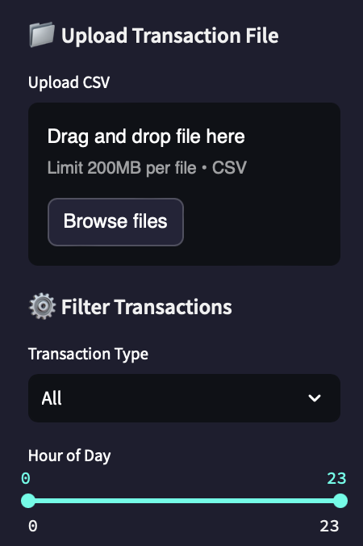
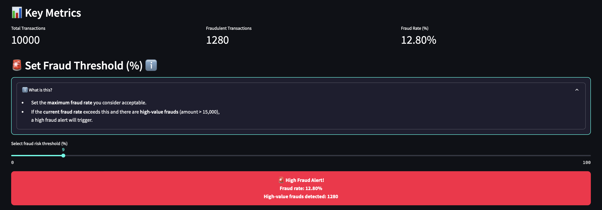
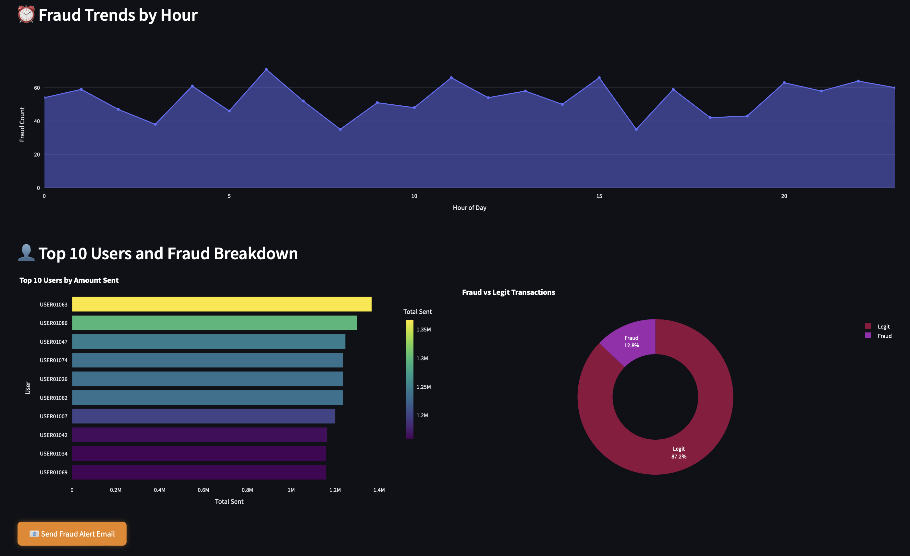
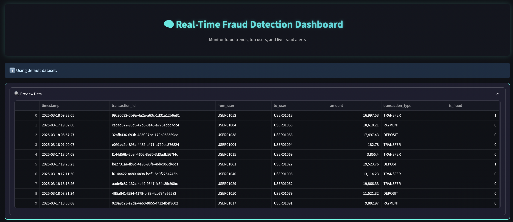

# Automated-ETL-Agent-for-Fraud-Detection
An intelligent ETL agent that automates data pipelines for real-time fraud detection and analytics with an interactive, real-time dashboard for detecting, visualizing, and monitoring **financial fraud** using **AI-powered insights**. Built with **Streamlit**, **Plotly**, and custom **neon-dark UI** for a seamless user experience. 🚨

---

## 💡 Project Overview

This dashboard enables:
- 📊 Real-time **fraud rate monitoring**
- 🚨 **Fraud threshold alerts** with customizable risk levels
- 👤 **Top user tracking** by transaction volume
- ⏰ Dynamic fraud trends by time of day
- 📈 Visual breakdown of **fraud vs legitimate** transactions

> Fully interactive — filter by transaction type, hour of day, and upload your own data!

---

## ⚙️ Features

| Feature                            | Description                                              |
|------------------------------------|----------------------------------------------------------|
| 🗂️ Upload CSV                      | Upload your own transaction data                         |
| 📊 Live KPIs                       | Total transactions, fraud count, fraud rate              |
| 🚨 Threshold Alerts                | Trigger **High Fraud Alerts** based on set thresholds    |
| 📈 Fraud Trends                    | Area chart of fraud by hour                              |
| 👤 Top Users Visualization         | Bar chart for **top 10 users** by amount sent            |
| 🍩 Fraud Breakdown Donut Chart     | Interactive fraud vs legit transactions                  |
| 📧 Simulated Email Alerts          | Trigger alert email simulation for high fraud events     |
| 🎨 Dark Mode + Neon CSS            | Stylish custom theme with **hover effects + animations** |

---

## 📸 Screenshots

### 📂 Upload & Filters


---

### 📊 KPIs + Fraud Alert


---

### 📈 Fraud Trends + Top Users


---

### 🧠 Dashboard Header + Data Preview


---

## 🛠️ Tech Stack

- `Streamlit` – Frontend framework for real-time interaction
- `Pandas` – Data manipulation
- `Plotly` – Dynamic visualizations (dark theme)
- `CSS` – Custom **neon dark mode styling**

---

## 📥 Getting Started

1. **Clone the repo**:
```bash
git clone https://github.com/yourusername/fraud-detection-dashboard.git
cd fraud-detection-dashboard
